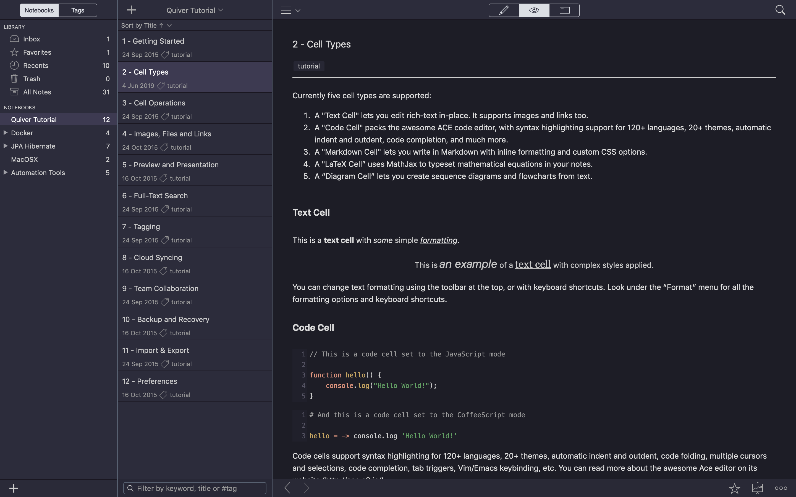

= Quiver Dark Purple Theme

image:https://img.shields.io/github/license/FatihBozik/quiver-dark-purple-theme?style=flat-square[Licence, link=https://github.com/FatihBozik/quiver-dark-purple-theme/blob/master/LICENSE]

Dark theme for http://happenapps.com/#quiver[Quiver] based on JetBrains' https://plugins.jetbrains.com/plugin/12100-dark-purple-theme[Dark Purple Theme].

.Preview

== Installation

1. Download https://raw.githubusercontent.com/FatihBozik/quiver-dark-purple-theme/master/Dark%20Purple.json?token=ABBKUP7JIU2D7UMHZRV6V4C477MHS[Dark Purple.json]
2. Open Quiver
3. Preferences -> Themes -> Load Theme...
4. Choose json file

== Useful Links

- https://github.com/HappenApps/Quiver/wiki/Themes
- https://github.com/HappenApps/Quiver/wiki/How-to-Design-a-Custom-Theme